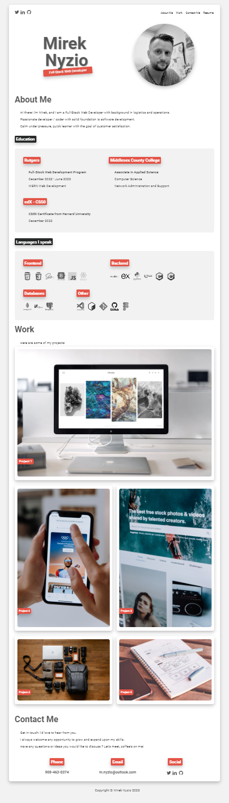

# 02 Advanced CSS: Portfolio

## Github repo link

[Github repository](https://github.com/mnyzio/portfolio)

## Link to deployed website

[Link to deployed site](https://mnyzio.github.io/portfolio/)


## Deployed projects

### Password Generator
Website designed to help users generate random and complex passwords 
based on selected character types
#### Project Github repo link

[Github repository](https://github.com/mnyzio/password-generator)

#### Link to deployed project website
[Link to deployed site](https://mnyzio.github.io/password-generator/)


##  Comments

```
Site currenly does not show any real projects and all images in work section are simply a placeholders. 
Each image is a link that opens google.com website in new tab when clicked.

Links to social profiles and site navigation are fully functional.
```

## Description 

```
This challenge was designed to create portfolio website from scratch to showcase our work to potential employer.
End result of that is fully functional website that:
1. Contains functional links to different parts of the page
2. Shows name and avatar of the designer
3. Contains clean and organized code that includes suficient comments
4. Is deployed on Github pages
```


## User Story

```
AS AN employer
I WANT to view a potential employee's deployed portfolio of work samples
SO THAT I can review samples of their work and assess whether they're a good candidate for an open position
```


## Acceptance Criteria

Here are the critical requirements necessary to develop a portfolio that satisfies a typical hiring manager’s needs:

```
GIVEN I need to sample a potential employee's previous work
WHEN I load their portfolio
THEN I am presented with the developer's name, a recent photo or avatar, and links to sections about them, their work, and how to contact them
WHEN I click one of the links in the navigation
THEN the UI scrolls to the corresponding section
WHEN I click on the link to the section about their work
THEN the UI scrolls to a section with titled images of the developer's applications
WHEN I am presented with the developer's first application
THEN that application's image should be larger in size than the others
WHEN I click on the images of the applications
THEN I am taken to that deployed application
WHEN I resize the page or view the site on various screens and devices
THEN I am presented with a responsive layout that adapts to my viewport
```


## Mock-Up

The following animation shows the web application's appearance and functionality:



